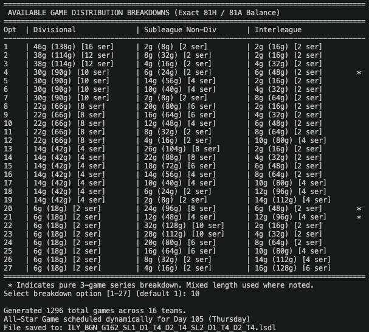

# OOTP Schedule Generator

This script generates custom OOTP baseball schedule files in XML format for leagues with multiple subleagues, divisions, and teams. It supports balanced intra-division scheduling, mixed-length series, optional interleague play, and dynamic All-Star Game placement while keeping the season timeline realistic.

## Table of Contents

- [Overview](#overview)
- [Prerequisites](#prerequisites)
- [Features](#features)
- [Usage](#usage)
- [Command-Line Parameters](#command-line-parameters)
- [Interactive Schedule Breakdown Selection](#interactive-schedule-breakdown-selection)
- [Game Distribution Logic](#game-distribution-logic)
- [All-Star Game Placement](#all-star-game-placement)
- [Output](#output)
- [Notes](#notes)

---

<h2><u>Script</u></h2>

### ootp_schedule_generator.py

Generates a full season schedule for an OOTP league, including home/away balancing, mixed series lengths, calendar-aware spacing, and optional end-of-season divisional locking. The output is intended for use as an OOTP `.lsdl` schedule file.

**Prerequisites:**
- Python 3
- No external dependencies required

**Features:**
- Multiple subleagues and divisions
- Configurable team counts per division
- Adjustable games per team
- Mixed-length series support, including standard 2/3/4-game patterns and MLB-style odd/split logic such as 6/7 and 3/4
- Optional interleague play, with default enabling when more than one subleague is present
- Auto or interactive valid distribution selection, including exact-match breakdown previews
- XML output compatible with OOTP schedule imports
- Dynamic All-Star Game placement based on target day or weekday
- Reserved end-of-season divisional windows to close the schedule cleanly
- Realistic calendar packing with consecutive-day limits and deliberate final-weekend lock-in behavior
- Optional balanced-game XML flag written as `balanced_games`
- Home/away balancing and series reordering logic to reduce parity drift across the season

**Usage:**

```bash
python ootp_schedule_generator.py \
  -s 2 \
  -d 2 \
  -t 4 \
  -g 162 \
  -il 1 \
  --non-interactive
```

This creates a schedule for:
- 2 subleagues
- 2 divisions per subleague
- 4 teams per division
- 162 games per team
- interleague play enabled
- automatic selection of the first valid schedule breakdown

A more explicit ASG-focused example:

```bash
python ootp_schedule_generator.py \
  -s 2 -d 2 -t 4 -g 162 \
  -a 105 \
  -aw Thursday \
  -ab 3 \
  -aa 3 \
  -sdw Friday \
  -sm April \
  -sd 1
```

This places the All-Star break near day 105 while respecting the requested weekday and spacing around the break.

A practical example of the newer split-series behavior is a 154-game league with 2 subleagues, 2 divisions, and 6 teams per division:

```bash
python ootp_schedule_generator.py \
  -s 2 -d 2 -t 6 -g 154 \
  -aw Friday \
  -ab 3 \
  -aa 3 \
  -sdw Friday \
  -sm April \
  -sd 1 \
  --non-interactive
```

This can generate valid odd-count breakdowns such as divisional totals that include 13-game patterns and split subleague/interleague series, while still maintaining a realistic season timeline and calendar-friendly All-Star break.

**Command-Line Parameters:**
- `-s, --subleagues`: Number of subleagues in the league.
- `-d, --divisions`: Number of divisions in each subleague.
- `-t, --teams-per-div`: Number of teams in each division.
- `-g, --games`: Total games per team for the season.
- `-il, --interleague`: Enable or disable interleague play (`0` or `1`). When omitted, the script defaults to `1` when there is more than one subleague and `0` otherwise.
- `-bg, --balanced`: Toggle balanced scheduling behavior (`0` or `1`). This value is written into the generated XML as `balanced_games` and also affects the filename prefix: `BGY` when enabled and `BGN` when disabled.
- `-a, --allstar-game-day`: Target calendar day for the All-Star Game. This is a day count within the generated season timeline.
- `-aw, --asg-weekday`: Force the All-Star Game to a specific weekday such as `Thursday`. This overrides the target day when used together with `-a`.
- `-ab, --asg-before`: Number of days to reserve before the All-Star break.
- `-aa, --asg-after`: Number of days to reserve after the break.
- `-sdw, --start-day-of-week`: Day the schedule should begin on. Accepts weekday names such as `Monday` or numeric values `1-7`, where `1 = Sunday` and `7 = Saturday`.
- `-sm, --start-month`: Month the schedule should begin in. Accepts month names such as `April` or numeric values `1-12`.
- `-sd, --start-day`: Day of the month the schedule should begin on.
- `-o, --output`: Custom output filename for the generated XML.
- `--non-interactive`: Skip the breakdown prompt and automatically select the first valid option.
- `-ed, --end-divisional`: Number of divisional series to reserve for the very end of the season. This helps lock divisional play into the final stretch and keeps the finish more realistic.

**Interactive Schedule Breakdown Selection:**

When the script runs in interactive mode, it displays all valid schedule breakdown combinations and prompts the user to choose the option that best fits the league setup.



This prompt shows the available distribution options, the selected choice, and the generated season summary after the schedule is created.

**Game Distribution Logic:**

The script validates possible game distributions before generating the schedule. It checks divisional, subleague, and interleague totals against the league structure and the total games per team, then presents each valid combination. These can include:
- all 3-game series
- mixed 3-game and 4-game series
- mixed 2-game and 3-game series
- odd-count MLB-style variants such as 13-game divisional splits and 6/7 or 3/4 subleague/interleague breakdowns

The generator now evaluates the full set of valid combinations and includes a breakdown preview that shows the exact divisional, subleague, and interleague totals for each option. In non-interactive mode, it automatically selects the first valid solution; in interactive mode, the user can choose from the full list of valid schedules.

The schedule builder also contains logic for asymmetrical split series, where an opponent pair can be upgraded from a shorter series length to a longer one to satisfy exact totals while keeping the season’s spacing and home/away balance realistic.

**All-Star Game Placement:**

When `-a` or `-aw` is provided, the script attempts to place the All-Star break in a realistic calendar position while preserving the season structure. The calculation adjusts the actual break day to the nearest valid weekday and reserves the requested number of days before and after the break. This keeps the All-Star break anchored to the season timeline without disrupting the series flow.

The script also allows the season to close out with a set number of reserved divisional windows using `-ed`, which helps keep the final stretch geographically and competitively realistic. If both `-a` and `-aw` are provided, the weekday override takes precedence.

**Output:**

The script writes an XML schedule file to the current directory by default, using names such as:

```text
ILY_BGN_G162_SL1_D2_T4_SL2_D2_T4.lsdl
ILY_BGY_G162_SL1_D2_T4_SL2_D2_T4.lsdl
```

The `BGY` segment is used when `-bg 1` is enabled; otherwise the filename uses `BGN`. This keeps the file name consistent with the XML `balanced_games` flag and avoids the older issue where both outputs were labeled as `BGY`.

The generated file contains a root `SCHEDULE` element with attributes including:
- `type`
- `inter_league`
- `balanced_games`
- `games_per_team`
- `start_day_of_week`
- `start_month`
- `start_day`
- `allstar_game_day` (added when an ASG placement is calculated)

Each game is written as a `<GAME>` element with:
- `day`
- `time`
- `away`
- `home`

**Notes:**
- If the script is run in an interactive terminal, it asks the user to select a valid game distribution.
- If `stdin` is not a TTY or `--non-interactive` is passed, it automatically chooses the first valid distribution.
- `-aw` overrides the target date from `-a` when both are present.
- `start_day_of_week` is encoded on a Sunday-to-Saturday scale (`1-7`) to match the script’s internal weekday calculations.
- The script preserves both the target total game count and the exact split-series structure, including MLB-style odd totals and asymmetrical series patterns.
- The seasonal packing logic keeps series spaced realistically while reserving a final divisional closing stretch when `-ed` is used.
- The schedule format is intended for OOTP import and is not a general baseball scheduling library.

---
